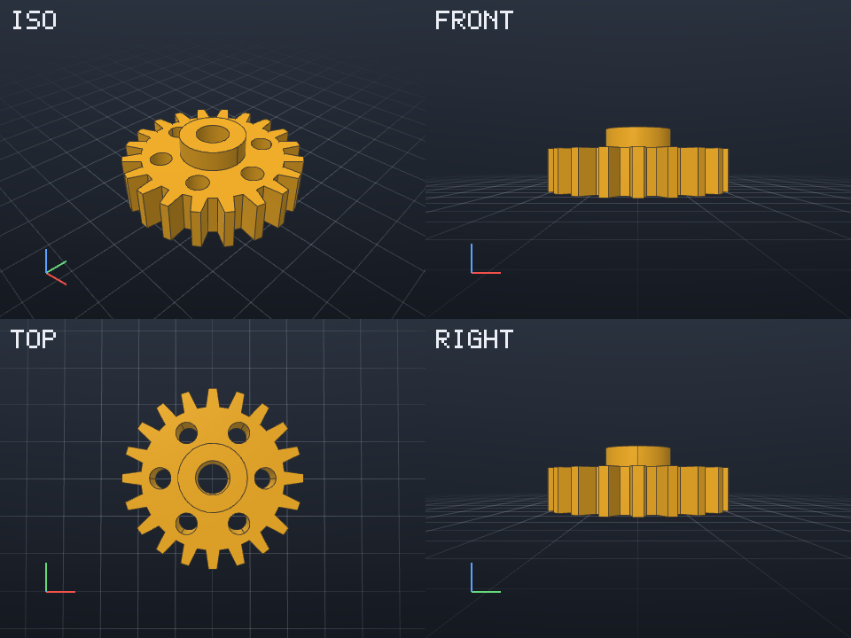

# Command line

```bash
pycodecad part.py [--read-only] [--no-run]           # the window
pycodecad parts/gear/                                # the window on a folder
pycodecad examples [folder]                          # copy the examples there once, open them
pycodecad check part.py                              # run it, print the result as JSON
pycodecad render part.py out.png [--views ...] [--size WxH] [--frame N]
pycodecad export part.py out.stl [--profile bambu]   # also .3mf .step .glb .brep
pycodecad context part.py                            # the AI context
pycodecad --version
```

The window is described in [The window](window.md). `check`, `render` and `export` run the script fresh, without a window, in a child process, and take
`--set KEY=VALUE` for [parameters](parameters.md#on-the-command-line). `pycodecad <command> --help`
lists the options of each command.

## examples

`pycodecad examples` copies the examples that come with pycodecad to `./pycodecad-examples` (or the
folder you give) and opens the window on it. When the folder already exists it is opened as it is,
so your changes to the examples stay. `--no-run` opens it without running.

## check

Runs the script and prints the result as JSON:

```bash
pycodecad check part.py
```

```json
{
  "ok": false,
  "file": "/home/me/parts/part.py",
  "error": "ZeroDivisionError: division by zero",
  "where": "/home/me/parts/part.py:2",
  "traceback": "Traceback (most recent call last):\n  File ...",
  "stdout": "",
  "warnings": [],
  "objects": [],
  "objects_total": 0,
  "frames": 0,
  "parameters": [],
  "duration": 0.002,
  "time": "2026-09-26T07:52:08",
  "pycodecad": "X.Y.Z"
}
```

| Field | Meaning |
| --- | --- |
| `ok` | The script ran without an error |
| `file` | The script |
| `error` | The last line of the error, or `null` |
| `where` | `file:line` in your own code where it failed, or `null` |
| `traceback` | The traceback of your own files |
| `stdout` | What the script printed (the end of it when long) |
| `warnings` | For example "Nothing shown: call show(...)" or an absolute path |
| `objects` | Each shown object: `name`, `color` (`#RRGGBB`), `volume` (mm³, `null` if not a solid), `bbox` (`min`, `max`) |
| `objects_total` | The number of objects (the list stops at 1000) |
| `frames` | The number of frames of an animation (`frame()` calls); 0 for a still scene |
| `parameters` | Each exposed function with its parameters, limits, default and the `value` the run used |
| `duration` | Seconds the run took |
| `time`, `pycodecad` | When it ran, and the pycodecad version |

The same JSON is left in `.pycodecad/part.py.last-run.json` after every run ([Files](files.md)).

## render

Writes a PNG without a window (off-screen OpenGL), with edges, grid and axes:

```bash
pycodecad render part.py out.png                                         # iso view, 800x600
pycodecad render part.py out.png --views front --size 1200x900
pycodecad render part.py out.png --views iso,front,top,right --size 600x450   # a labeled grid
pycodecad render part.py out.png --views window                          # what the window shows
pycodecad render part.py out.png --frame 30                              # frame 30 of an animation
```



- `--views` takes `iso`, `front`, `back`, `left`, `right`, `top` and `bottom`. Several, separated by
  commas, make a grid two columns wide, each view labeled.
- `--views window` uses the camera of the window, as you last left it, and its view size. It is
  saved about a second after the camera stops moving, and cannot be combined with other views.
- `--size WIDTHxHEIGHT` is the size of each view, 1 to 8192 pixels per side (default 800x600, or
  the window's size with `--views window`).

## export

```bash
pycodecad export part.py part.stl
pycodecad export part.py part.3mf --profile bambu
```

The format comes from the extension:

| Extension | Format |
| --- | --- |
| `.stl` | STL, for 3D printing |
| `.3mf` | 3MF, one named, colored object per `show()` |
| `.3mf --profile bambu` | 3MF that Bambu Studio opens with names and colors |
| `.step` | STEP, for CAD |
| `.glb` | GLB, for the web |
| `.brep` | BREP (OpenCascade) |

STL, 3MF, STEP and BREP exports use the real build123d shapes; GLB uses the preview triangles and
edges. A scene with meshes from `import_mesh()` can be exported as STL, 3MF or GLB, not STEP or
BREP. `export` prints what the script printed, then `Wrote <path>`.

## context

```bash
pycodecad context part.py
```

Runs the script and prints the text of **Copy AI context**: see
[Working with an AI assistant](ai.md).

## Checked before running

Wrong arguments are reported before the script runs, with exit code 1:

- `render` output not ending in `.png`, an export extension that is not one of the formats above,
  `--profile` on a file that is not `.3mf`;
- an output folder that does not exist;
- `--size` not like `800x600` or outside 1..8192;
- an unknown view, `window` combined with other views, or `--views window` before any window saved
  a camera for that script.

A malformed option (an unknown `--profile`, `--set` without `=`) is an argparse error: exit code 2.

## Exit codes

| Code | When |
| --- | --- |
| 0 | Success. `check` also returns 0 when the script runs but shows nothing (with a warning) |
| 1 | The script failed (`check` prints the JSON, `render`/`export` the error on stderr); `render` or `export` of a script that shows nothing; wrong arguments; a file that cannot be read |
| 2 | Malformed command line (argparse) |
| 130 | Interrupted |

## Ctrl+C

Ctrl+C (or SIGTERM, SIGHUP) stops the running script at once (on Linux with anything it started) and pycodecad
exits with 130. The last-run file then says "Stopped".
