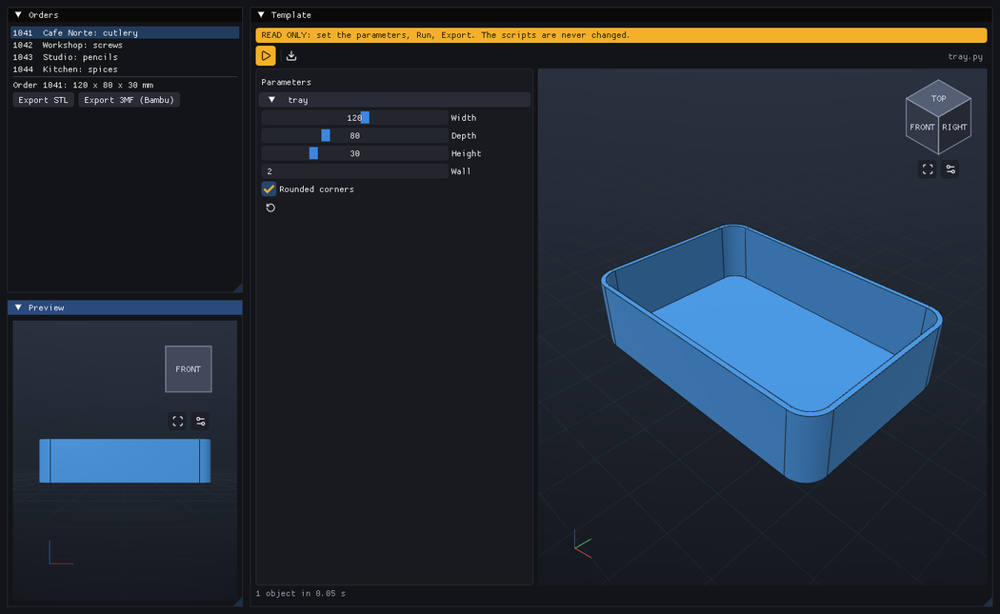

# Embedding pycodecad in your app

> **Experimental.** `pycodecad.embed` works and is tested, but its names and details may
> change in a minor version. The window (`pycodecad file.py`), the command line and the script API
> are stable.

The pycodecad window is made of parts you can use in your own native app: a **Workspace** (files,
code, parameters and 3D view of a part, exactly like the window) and a **Viewer** (only a 3D view).
They are [Dear ImGui](https://github.com/ocornut/imgui) components: your app draws them inside its
own ImGui windows, in its own frame loop.

Use it when a script is not enough and a new program would be too much: an order desk that fills
in the parameters of a template, a tool that shows several parts side by side, a panel for a
machine. Everything else stays as in the window: the script runs only when you call `run()`, the
file is written only on `save()`, each run is a child process.

## Example

[examples/embedded_app.py](https://github.com/offerrall/pycodecad/blob/main/examples/embedded_app.py): pick an order, the tray of
`tray.py` is rebuilt to its measures, a second view shows it from the front, and Export
writes one file per order.



```python
from slimgui import imgui
import pycodecad.embed as p3

window = p3.create_window("My app")
part = p3.Workspace("part.py")           # code + parameters + 3D view, like the pycodecad window
viewer = p3.Viewer()                     # only a 3D view, with a camera of its own

while window.frame(keep_open=part.dirty()):
    imgui.begin("Part")
    part.draw()                          # fills the available region of the ImGui window
    part.close_prompt(window)            # Save / Discard / Cancel when closing with unsaved changes
    imgui.end()

    imgui.begin("Orders")
    if imgui.button("Order 42"):
        part.values["tray.width"] = 150.0
        part.run()                       # explicit, as always
    imgui.end()

    imgui.begin("Preview")
    viewer.draw(part.shown)              # the same objects, another camera
    imgui.end()
window.close()
```

Draw a Workspace before the widgets that read its state: `draw()` also collects finished runs, so
what is drawn after it sees this frame's results.

## Reference

### `create_window(title="pycodecad", size=(1440, 880), visible=True) -> Window`

A new GLFW window with an OpenGL 3.3 context and pycodecad's ImGui backend (fonts, icons, style).
`visible=False` makes a hidden window (tests, screenshots).

### `Window(handle, ctx=None, owns=False)`

pycodecad's ImGui backend on a GLFW window you already have (see
[Your own GLFW window](#your-own-glfw-window)). `create_window` makes one with `owns=True`.

- `frame(keep_open=False) -> bool`: show the frame built since the last call, wait for input (up to
  0.25 s, less while a script runs) and begin the next ImGui frame. False when the window closes.
  With `keep_open=True` a close request does not close it: `close_requested` becomes True instead.
- `close_requested`: the user closed the window while `keep_open` was True.
- `request_close()`: close as if the user did.
- `set_title(title)`, `screenshot(path)` (a PNG of the frame, written when it is shown).
- `close()`: close every open Workspace and Viewer (their runs are killed), then the backend; also
  the window and GLFW when it owns them.
- `handle` (the GLFW window), `ctx` (the moderngl context), `events` (this frame's typed text and
  key presses).

### `Workspace(path, read_only=False, run=True)`

A part, like a pycodecad window: the `.py` files of a folder, one of them edited, the main one run (see
[A part in several files](window.md#a-part-in-several-files)). `path`: the main file, or the
folder. A missing main file is created from a small example (not when `read_only`). `read_only`:
an order form, as [`--read-only`](window.md#read-only-mode): no code, no script is written, and
`choose(path)` runs another file of the folder. `run`: run the main file once when
build123d has loaded. Raises `OSError` when the file cannot be used.

- `draw()`: update, then draw into the available region of the current ImGui window. Its keyboard
  shortcuts (Run, Save, Save as, code zoom) work while that ImGui window has the focus.
- `update()`: start a requested run, collect finished runs, notice changes on disk. `draw()` calls
  it; call it every frame yourself for a Workspace you do not draw.
- `close_prompt(window)`: the Save / Discard / Cancel prompt, shown after the user closes a
  `frame(keep_open=part.dirty())` window. Save or Discard closes the window.
- Actions: `run()` (the main file, with the editor's text for the edited file), `stop()`,
  `save() -> bool`, `save_as(path) -> bool`, `reload()`, `discard()` (drop the unsaved changes),
  `export(extension, profile="generic", target=None)` (`target` is relative to the folder; by
  default the main file's name with that extension), `close()`.
- Files: `open(path, line=None) -> bool` edits another file (relative to the folder; `line` puts
  the cursor there); it refuses, with a message, while the editor has unsaved changes: `save()` or
  `discard()` first. `set_main(path)` makes another file the one that runs (its parameters and
  values start anew). `files()` lists the folder's `.py` files. `show_files = False` hides the
  list (e.g. an app that shows only a template).
- Your app's controls (the top bar is pycodecad's, but you decide what it offers):
  - `hidden`: a set of top-bar tools not drawn, from `TOOLS`: `"run"`, `"save"`, `"save_as"`,
    `"ai_context"`, `"copy"`, `"paste"`, `"export"`. A hidden tool's shortcut is off too (a hidden
    `"save"` makes Ctrl+S do nothing).
  - `buttons`: a list of `Button(label, action, tip="", enabled=True)` drawn after pycodecad's
    tools. `label` is an icon name of `pycodecad.icons.CODEPOINTS` (drawn as the icon, e.g.
    `"cloud-upload"`, `"arrow-left"`, `"x"`) or text; `action()` runs when it is clicked. Change
    the list or `enabled` between frames.
  - `on_save`: `on_save(workspace)` is called after every successful Save (the button, Ctrl+S,
    Save as, and Save in the unsaved-changes prompts), once the file is written. Use it to make
    Save mean "save to my server": upload `workspace.folder` there. Keep it fast (the frame waits
    for it): start a thread for the network and report with `workspace.say(message, error)`.

  ```python
  part = p3.Workspace(folder)
  part.hidden = {"save_as"}                            # one file name per project
  part.on_save = lambda ws: upload_in_a_thread(ws.folder)
  part.buttons = [p3.Button("arrow-left", close_project, "Back to the projects")]
  ```
- State: `values` (`{"function.param": value}`, sent to the script on the next run),
  `parameters` (what the last run exposed), `shown` (the objects of the last good run), `error`,
  `stdout`, `message` (the status line), `main` (the file that runs), `path` (the file in the
  editor; the main file until you open another), `folder`, `read_only` (of the whole Workspace),
  `dirty()`, `running()`, `ran()`, and `viewer` (its Viewer).

### `Viewer()`

A 3D view with its own camera: orbit, pan, zoom, view cube, Fit, and the edges / grid / axes
toggles.

- `draw(objects, size=None)`: draw a list of shown objects (e.g. `part.shown`) at `size` (ImGui
  units), by default the available region. It fits the first objects it gets, and again after a
  large change.
- `fit()`, `look_from(direction)` (e.g. `(0, -1, 0)` is the front view), `camera`, `display`,
  `picture() -> bytes` (a PNG of the view), `close()`.

## Your own GLFW window

Components need pycodecad's ImGui backend: it renders ImGui 1.92 textures (the font atlas, and the 3D
views as OpenGL textures) and gives the code editor its keyboard input in order. If your app
already has a GLFW window with an OpenGL 3.3 core context, wrap it instead of creating one, and let
pycodecad replace your ImGui renderer:

```python
glfw.make_context_current(handle)
window = p3.Window(handle, ctx=ctx)  # ctx: your moderngl context, if you have one (never released by pycodecad)
while window.frame():                # replaces glfw.poll_events / imgui.new_frame / render / swap_buffers
    ...
window.close()                       # the GLFW window, its previous input callbacks and your context stay yours
```

The contract:

- One `Window` per process, and its OpenGL context current while you draw.
- pycodecad owns the ImGui context and, until `close()`, the GLFW input callbacks of that window
  (`close()` puts back the ones it replaced).
- If your app already has a moderngl context on that window, pass it as `ctx`: a second
  `moderngl.create_context()` fails on some platforms (Wayland). pycodecad never releases a context
  it was given.
- ImGui texture ids are OpenGL texture names, as in Dear ImGui's own OpenGL backend: your
  `imgui.image(texture.glo, ...)` works too.
- Components are drawn between `frame()` calls; each has its own ImGui IDs, so several can share a
  window (one Workspace per ImGui window, so shortcuts go to the right one).
- Keep 3MF imports inside the scripts run by the Workspace. On Linux, alternating native 3MF
  reads in the host process (`import_mesh` or build123d's `Mesher`) with exports in forked runs can
  make lib3mf reject a UUID as duplicated. The regular window and CLI perform these operations in
  child processes, where this does not happen.
