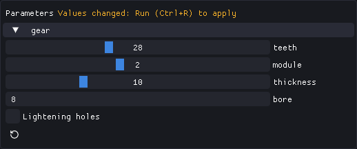

# Parameters

`expose(fn)` calls `fn` and returns what it returns. In the window, each parameter of `fn` gets a
control; everywhere else `fn` gets its defaults, or the values given with `--set`.

```python
from typing import Annotated

from build123d import Box
from pytypehint import Description, Label, Max, Min, Slider
from pycodecad import expose, show


def tray(width: Annotated[float, Min(20.0), Max(200.0), Slider(), Label("Width")] = 80.0,
         wall: Annotated[float, Min(0.8), Max(5.0), Description("Also the floor")] = 2.0,
         rounded: bool = True):
    ...
    return Box(width, 60, 25)


show(expose(tray), name="tray")
```

The full example is [examples/tray.py](https://github.com/offerrall/pycodecad/blob/main/examples/tray.py).

## Rules

`fn` must be a function defined with `def` (not a lambda or `async def`). Its parameters must be
simple, so a control can always be drawn for them:

- Type `int`, `float`, `bool` or `str`, each with a default.
- Annotated only with [pytypehint](https://offerrall.github.io/pytypehint/) `Min`, `Max`, `Step`,
  `Slider`, `Label` and `Description` (`Annotated[float, Min(0.0), ...]`).
- `Min`, `Max` and `Step` are for numbers; on a `str`, `Min` and `Max` limit its length. A `bool`
  takes only `Label` and `Description`.
- `Slider()` needs both `Min` and `Max`. Exclusive `Min`/`Max` are not supported.
- Numbers within ±1e9, and a `Step` of at least 1e-6.
- The default must be within `Min` and `Max`.

Anything else raises a `TypeError` that names the parameter. A script can expose several
functions, each once per run (a second `expose()` of the same function is an error).

## Controls



| Parameter | Control |
| --- | --- |
| `int` or `float` with `Slider()` | A slider between Min and Max (a float snaps to Step, counted from Min) |
| `int` or `float` | A number box; with `Step`, +/- buttons (an int steps by 1 by default) |
| `bool` | A checkbox |
| `str` | A text box (cut to Max characters) |

`Label` is the text next to the control (else the parameter's name) and `Description` its tooltip.
The panel shows one group per exposed function; values are kept within Min and Max.

## Run applies, Export uses what is on screen

- Changing a control only changes a value in memory. **Run** (Ctrl+R) runs the script with the new
  values; the panel says "Values changed: Run (Ctrl+R) to apply" until you do.
- **Reset** (the arrow under a group) returns that function to its defaults on the next Run.
- **Export** uses the values of the last good run: what is on screen.
- Values are never written into the script. When you edit the script, values whose parameter no
  longer exists, changed type or no longer fits are dropped and the default is used.

## On the command line

`check`, `render` and `export` take `--set KEY=VALUE`, repeatable. `KEY` is `param` or
`function.param` (the second wins when both are given):

```bash
pycodecad export tray.py tray.stl --set width=120 --set tray.rounded=false
pycodecad render tray.py tray.png --set width=120 --views iso,top
```

Values are converted to the parameter's type. A `bool` takes `true`, `1`, `yes`, `on` or `false`,
`0`, `no`, `off`. The run fails (exit code 1) when:

- a key matches no parameter of any `expose()` ("No exposed parameter ..."),
- a value is not of the parameter's type, or is outside its Min and Max.

Without `--set`, the defaults are used. `check` reports the values each run used in its
`parameters` field ([Command line](cli.md#check)).

## Order forms

A template with parameters opened with `pycodecad --read-only tray.py` is an order form: set the
measures, Run, Export. The code is not shown and the template is never changed. See
[read-only mode](window.md#read-only-mode).
