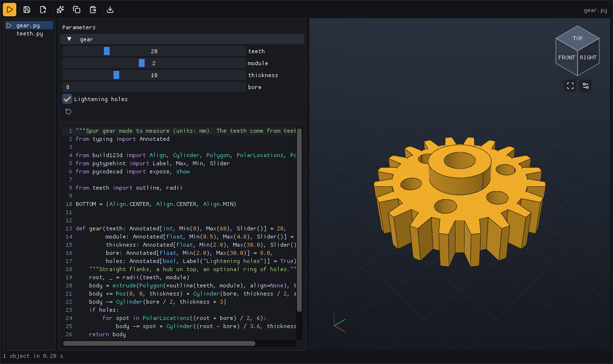
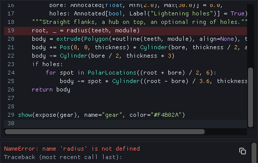
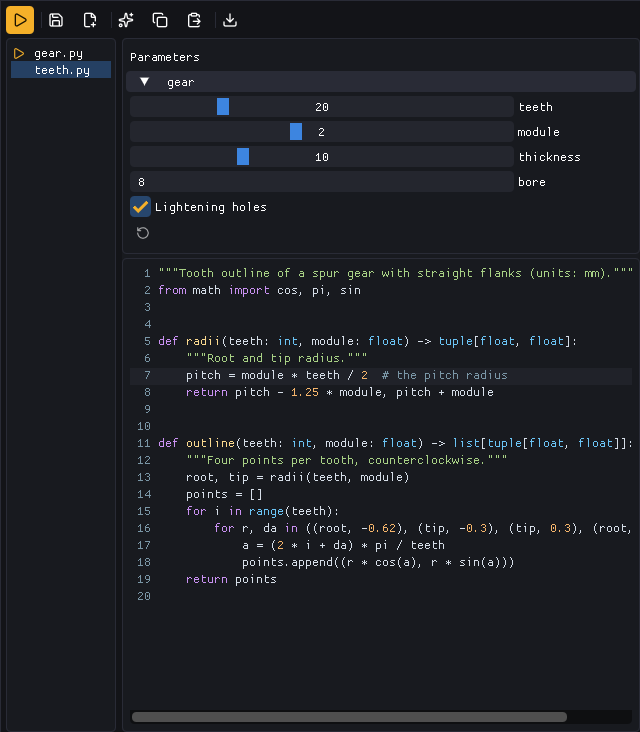
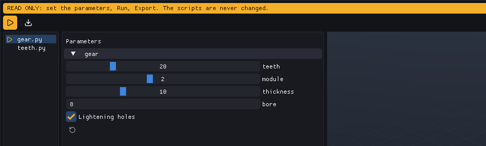
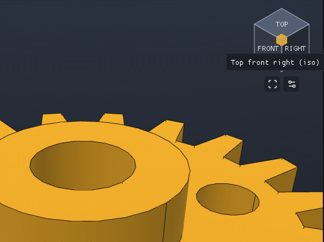
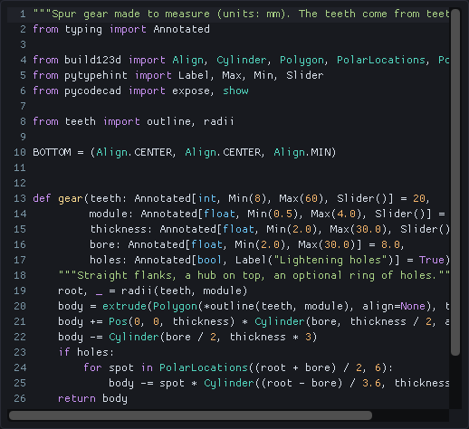

# The window

```bash
pycodecad part.py                 # open part.py (created from a small example if missing)
pycodecad gear/                   # open a folder: a part in several files
pycodecad part.py --no-run        # do not run it when the window opens
pycodecad part.py --read-only     # never write the files: see "Read-only mode"
```



The window works on the `.py` files of one folder: it edits one of them and runs the main one (see
[A part in several files](#a-part-in-several-files)). `pycodecad part.py` opens the folder of
`part.py` with `part.py` as the main file. Open as many windows as you like.

## Layout

- **Top bar**: icon buttons (hover one for its name and shortcut), the "Changed on disk" notice and
  the name of the file you edit (and of the main file, when you edit another one).
- **Left**: the files of the folder, then the [Parameters](parameters.md) panel (only when the
  script exposes a function), the code, and under it the error or what the script printed.
- **Right**: the 3D view, with the view cube, **Fit** and the display toggles.
- **Bottom**: the status line: the number of objects and how long the run took, or the error.

Drag the line between code and view to resize them.

## Nothing happens by itself

- The script runs once when the window opens (not with `--no-run`). After that it runs only when
  you press **Run** (Ctrl+R, F5 or Ctrl+Enter).
- The file is written only when you press **Save** (Ctrl+S).

Each run is a fresh child process, so a script can never break the window. When a run takes more
than half a second, **Stop** takes Run's place and kills it at once, whatever it is doing (on Linux
also any process the script started). Running again while a run is going replaces it.

When a run fails, the error, its file and line and the traceback of your own code are shown under
the code (the copy button copies them), the line is marked in the editor, and the last good objects
stay on screen. When the error is in another file of the folder, it says "in teeth.py, line 7":
click it to open that file at that line. See [Scripts](scripts.md#errors).



## A part in several files

A part is often several files: `gear.py` builds and shows the gear, `teeth.py` computes the
outline of its teeth. Open the folder, or any of its files:

```bash
pycodecad gear/            # the main file is the first .py (by name) that calls show()
pycodecad gear/gear.py     # the main file is gear.py
```



- The list on the left shows the folder's `.py` files (not those of subfolders, nor hidden ones: names that
  start with `.` or `_`); it follows the files that appear and disappear. Click one to edit it. With unsaved changes, the
  window first asks **Save**, **Discard** or **Cancel**.
- The **main file**, marked with a play icon, is the part: **Run always runs the main file**, also
  while you edit another one. Right-click a file to make it the main one. `pycodecad gear/` picks the
  first file (by name) that calls `show()`, else the first file, else it creates `part.py` from a
  small example.
- **Unsaved edits run.** Run uses the editor's text for the file you are editing, also when it is a
  module the main file imports (`import teeth`); every other file comes from disk.
- The parameters, the 3D view, the error, Export and the last-run file belong to the main file.
- Save, Save as, Reload, "Changed on disk" and the red dot are about the file you edit. Save as of
  the main file makes the copy the main file.

## Top bar

| Button | What it does |
| --- | --- |
| Run / Stop | Run the main file; Stop kills a long run |
| Save | Write the code to the file you edit |
| Save as | Write a copy under a new name and continue working on the copy |
| Copy AI context | Copy a text for an AI assistant ([AI](ai.md)) |
| Copy code | Copy all the code |
| Paste code | Replace all the code with the clipboard (Undo brings it back) |
| Export | STL, 3MF, 3MF for Bambu Studio, STEP, GLB, BREP, or a PNG picture of the view |

Export writes next to the main file with its name (`part.stl`, `part.png`...) and uses what is on
screen: the code and the parameter values of the last good run, even if you edited since. It runs
that code again, so it needs the other files as they were: if a helper module or an input file
(an STL or SVG the script imports, in the folder or its subfolders) changed since the run, Export
asks you to Run again (the files Export itself wrote do not count, unless they changed after or
a run reads them). A script that uses randomness or the network can still export something
else than the screen shows.

## Saving and changes on disk

- A red dot next to the file name (and `*` in the title) means the editor has unsaved changes.
- Closing the window with unsaved changes asks **Save**, **Discard** or **Cancel**.
- When someone else changes the file (another editor, an AI assistant), the top bar says
  **Changed on disk** with a **Reload** button. Reload replaces the code with the file (unsaved
  edits are lost, and the notice says so); then press Run to see it. pycodecad never reloads by itself.
- **Save as** asks for a name (next to the current file, or a full path) and refuses one that
  already exists.

## Read-only mode

`pycodecad --read-only template.py` is for using scripts to make parts, with no way to change them:
a band says READ ONLY and the window shows no code, only the files of the folder, the
[parameters](parameters.md#order-forms), Run, Export and the 3D view. A click on a file runs it.
Scripts are never written, and Run always runs the file as it is on disk. Read only is only this
option: a file you cannot write opens as usual (Save then reports the error).



## The 3D view

| Mouse | Action |
| --- | --- |
| Left drag | Orbit |
| Right or middle drag, Shift+left drag | Pan |
| Wheel | Zoom |
| Double click | Fit the view |

The view cube in the top right turns with the camera. Click a face, an edge or a corner to look
from there (the top-front-right corner is the iso view). Under it, **Fit** and a button that turns
**Edges**, **Grid** and **Axes** on and off. The view fits itself the first time and when the part
changes a lot.



When the script makes an animation with `frame()` (see [Scripts](scripts.md#frame)), a bar under the
view plays it in a loop: **Pause**/**Play**, a slider to go to any frame (it pauses there), and the
frame number and time. Each Run starts it again from the first frame.

## The editor

Click places the cursor, drag selects, a double click selects a word and a triple click a line;
Shift+click extends the selection. The code zoom goes from 50% to 300% in browser-like steps; when
it is not 100% it shows at the bottom right (click it to go back to 100%).



## Shortcuts

| Keys | Action |
| --- | --- |
| Ctrl+R, F5, Ctrl+Enter | Run |
| Ctrl+S | Save |
| Ctrl+Shift+S | Save as |
| Ctrl+Z, Ctrl+Shift+Z or Ctrl+Y | Undo, redo |
| Ctrl+C, Ctrl+X | Copy, cut (the whole line when nothing is selected) |
| Ctrl+V | Paste |
| Ctrl+A | Select all |
| Ctrl+ +, Ctrl+ -, Ctrl+0, Ctrl+wheel | Code zoom in, out, back to 100% |
| Tab, Shift+Tab | Indent, unindent (the selected lines) |
| Enter | New line, keeping the indentation (one more level after `:`) |
| Arrows, Home, End, Page Up, Page Down | Move (Home goes to the first character, then to the line start) |
| Ctrl+Left, Ctrl+Right | Move by word |
| Ctrl+Home, Ctrl+End | Start, end of the code |
| Ctrl+Backspace, Ctrl+Delete | Delete a word |
| Shift + any move | Select |

Run, Save, Save as and the code zoom work wherever the focus is, except in a dialog, a menu or a
text field. The zoom keys follow the character the key types, so they work on any keyboard layout
(and on the keypad).
